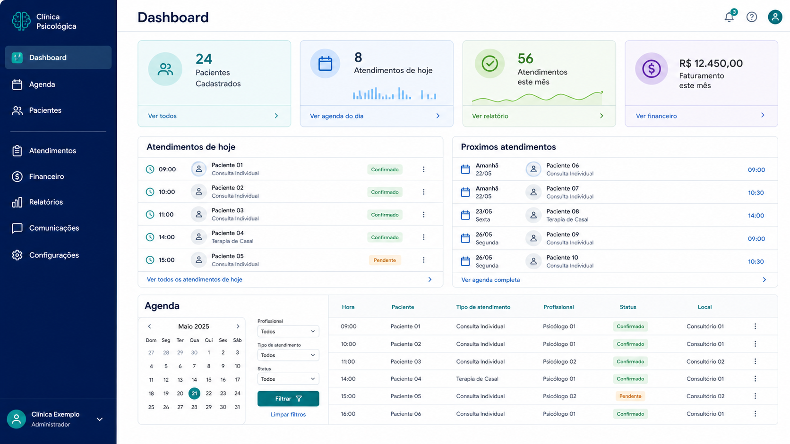
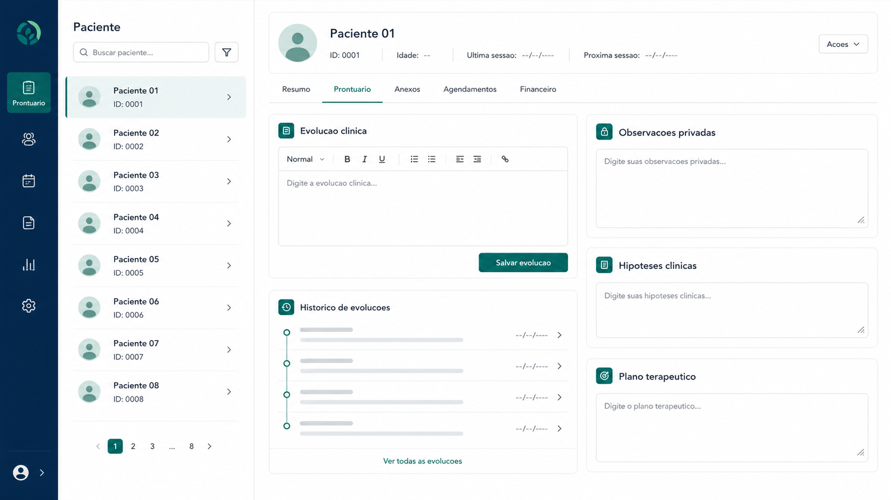
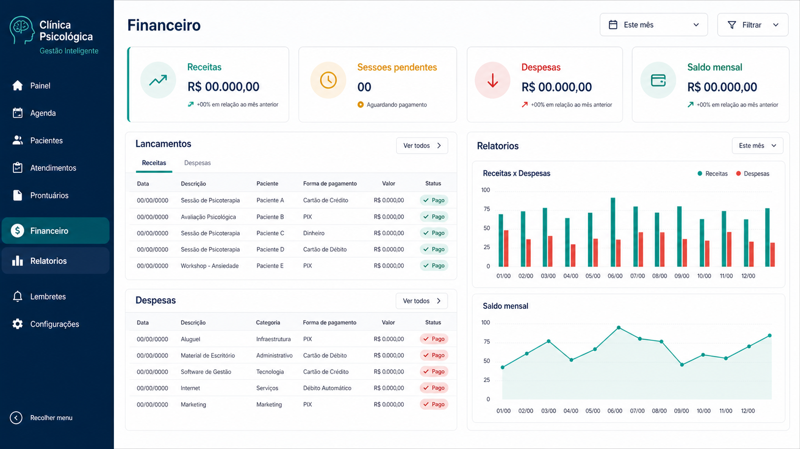

# Previa Visual dos Modulos

Estas imagens podem ser usadas em apresentacoes comerciais, propostas, mensagens para clientes e demonstracoes iniciais.

## Capa do Sistema


Uso sugerido:

- capa de proposta comercial
- primeira tela de apresentacao
- imagem para WhatsApp ou e-mail

## Dashboard e Agenda



Modulos representados:

- Dashboard
- Agenda
- Pacientes
- Atendimentos do dia
- Proximos atendimentos

## Prontuario



Modulos representados:

- Prontuario
- Evolucao clinica
- Observacoes privadas
- Hipoteses clinicas
- Plano terapeutico

## Financeiro e Relatorios



Modulos representados:

- Financeiro
- Receitas
- Despesas
- Sessoes pendentes
- Saldo mensal
- Relatorios

## Arquivos gerados

```text
docs/imagens/capa-sistema.png
docs/imagens/dashboard-agenda.png
docs/imagens/prontuario.png
docs/imagens/financeiro-relatorios.png
```
